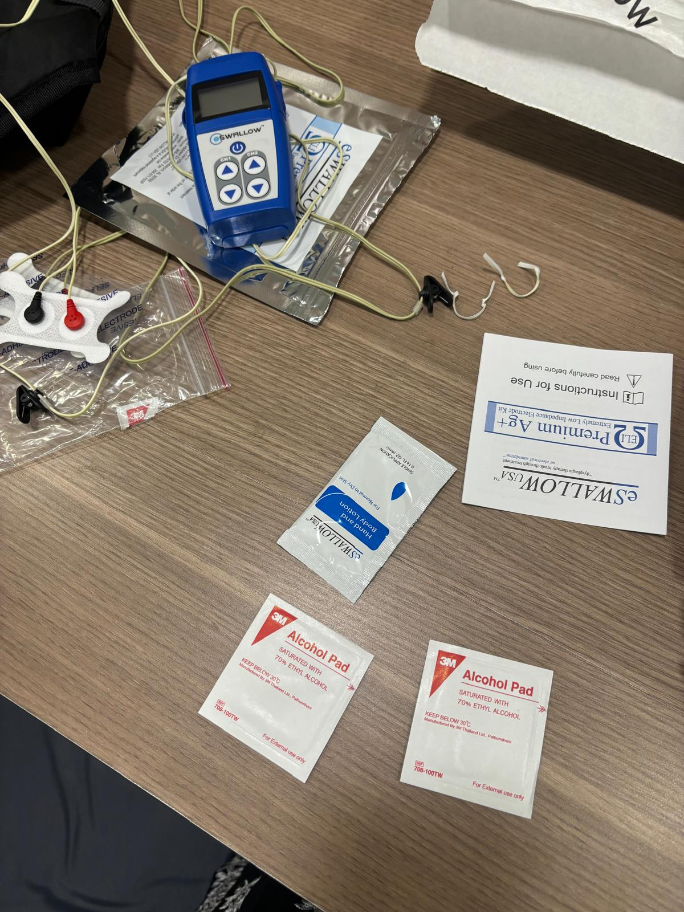
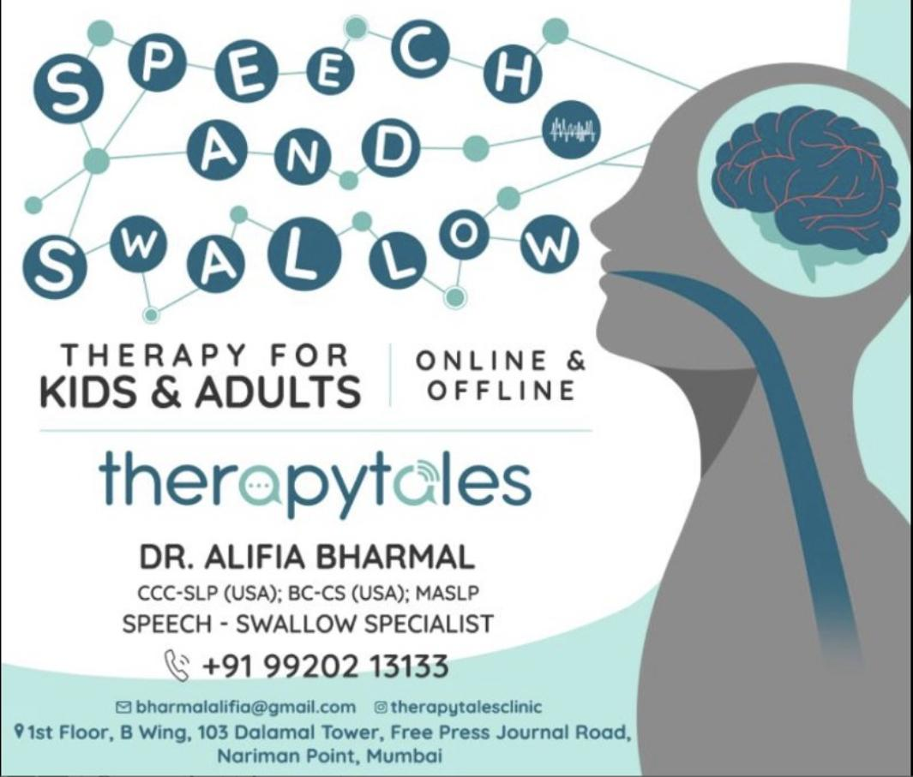

# NeuroLearner

**An adaptive learning platform for children with ADHD and dyslexia.**

---

  
  

## why i built this

In 2024, I interned at [TherapyTales](https://www.instagram.com/therapytalesclinic/) in Mumbai - a speech and swallow therapy clinic run by Dr. Alifia Bharmal. I worked with kids who had speech delays, swallowing disorders, ADHD, and dyslexia. I watched therapists use clinical-grade equipment and personalized approaches to help each child. But outside the clinic, those same kids went back to classrooms and worksheets that were designed for a brain that works differently from theirs.

I watched a child try the same worksheet for the third time. She wasn't struggling because she wasn't smart - she was struggling because by the time the system told her she got something right, she'd already decided she was bad at this. She'd already checked out.

And I couldn't help but wonder: **if the therapists at TherapyTales can adapt to each child in real time, why can't the tools kids use every day do the same thing?**

So I looked it up. **1 in 5 children** in the US have learning differences like ADHD or dyslexia. That's **4 million kids** under 18. **60% of students with learning disabilities drop out of high school** - compared to the average dropout rate of 6.5%. Kids with reading problems specifically? **62% dropout rate.** And 45% of kids with ADHD also have a co-occurring learning disability on top of it.

These aren't broken kids. They're kids stuck in a system that gives feedback in 5-minute windows when their brains need it in 30-second ones. The worksheet wasn't designed for their brain. So I built something that was.

---

## What It Does

NeuroLearner adjusts content pacing, visual complexity, and feedback loops in real time based on each child's cognitive profile. It doesn't make things easier. It makes the feedback loop shorter so kids feel progress before they give up.

**Piloted with 15 students** at a local after-school program in Berkeley:
- **35% improvement** in task completion rates
- **40% reduction** in frustration indicators

## Tech Stack

| Layer | Technology | Why |
|-------|-----------|-----|
| Backend | Python (Flask) | Lightweight, fast iteration for a pilot |
| ML/Adaptive Model | TensorFlow | Flexible enough for continuous profile updates |
| Frontend | React | Component-based UI makes it easy to swap visual complexity levels |
| Database | PostgreSQL | Relational structure for cognitive profiles + progress data |
| Privacy | COPPA-compliant | No PII stored. All data anonymized at ingestion. |

## Documentation

| Document | What's In It |
|----------|-------------|
| [PRD.md](./docs/PRD.md) | Product requirements, personas, feature priorities |
| [USER_RESEARCH.md](./docs/USER_RESEARCH.md) | Parent, teacher, and psychologist interviews + observations |
| [ARCHITECTURE.md](./docs/ARCHITECTURE.md) | System design, adaptive engine, privacy model |
| [SPRINT_LOG.md](./docs/SPRINT_LOG.md) | 6 sprints of building, pivoting, and learning |
| [METRICS.md](./docs/METRICS.md) | Pilot results across 15 students |

---

Built by **Tanya Hemdev** - PM/builder, UC Berkeley (Cognitive Science + Data Science).

If you work in special education, child psychology, or EdTech accessibility, I'd love to talk: tanyahemdev@berkeley.edu

https://github.com/user-attachments/assets/ac1bbfba-f5eb-4d4b-b578-a10d12a457d6

For Kabir :)

